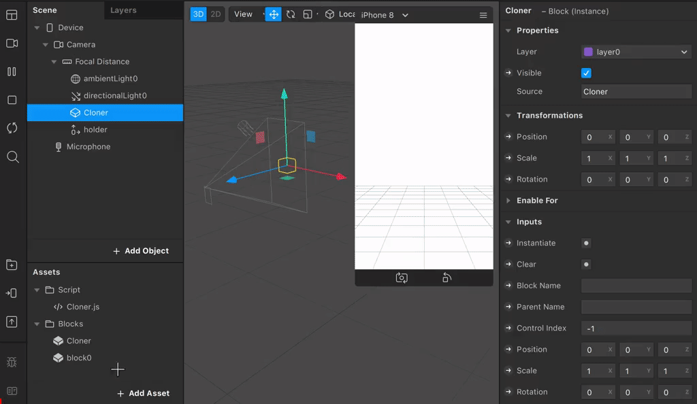
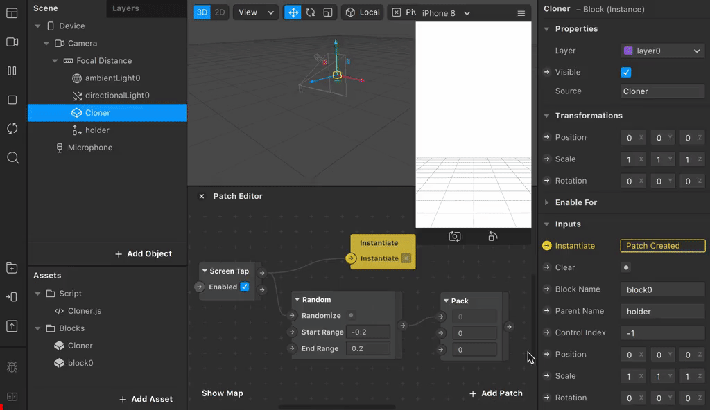
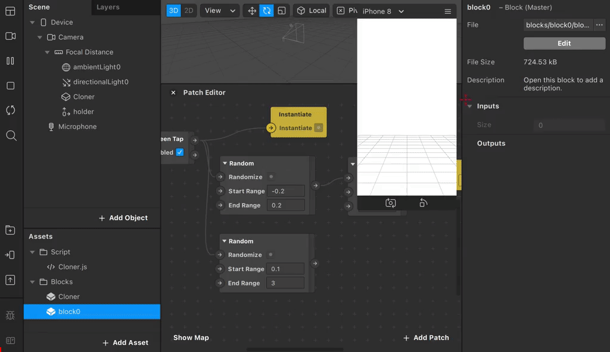

# Cloner

**Cloner** is a Spark AR tool for dynamically instantiating blocks and controlling it without coding.


## Install

0. [Download Cloner.js](https://github.com/pofulu/sparkar-cloner/raw/master/ClonerDemo/scripts/Cloner.js) (Right click and Save as)
1. [Download Cloner.arblock](https://github.com/pofulu/sparkar-cloner/raw/master/ClonerDemo/blocks/Cloner/Cloner.arblock)
2. Drag/Drop both of them to your Spark AR project.
3. Add capability: `Project > Edit Properties > Capabilities > + > Scripting Dynamic Instantiation`
4. You can also [Click Here to Download a Sample Project (v104.1)](https://github.com/pofulu/sparkar-cloner/raw/master/CloneDemo.arprojpkg).


## Usage 

Drag the **Cloner Block** to Scene and set inputs, these are basic settings:

| Inputs      | Type  | Description                                      |
| ----------- | ----- | ------------------------------------------------ |
| Instantiate | Pulse | Trigger this to create an instance.              |
| Clear       | Pulse | Trigger this to clear all instance.              |
| Block Name  | Text  | The name of the block to be instantiated.        |
| Paretn Name | Text  | The name of the scene object that holds instance |



The following settings are used to control instance's **Transform**:

| Inputs        | Type     | Description                                                  |
| ------------- | -------- | ------------------------------------------------------------ |
| Control Index | Number   | The index of instance to be controlled. <br />The index is start from `0`.<br /> `-1` means the last instantiated instance;<br /> `-2` means all of instances. |
| Position      | Vector 3 | The position of controlled instance.                         |
| Scale         | Vector 3 | The scale of controlled instance.                            |
| Rotation      | Vector 3 | The rotation of controlled instance.                         |




You can control the **Inputs** of instance block with following advanced setting:

| Inputs | Type | Description                                                  |
| ------ | ---- | ------------------------------------------------------------ |
| Prefix | Text | The prefix of **To Script** varaible name.                   |
| Inputs | Text | The map to bridge instance's **Inputs** to **To Script**. [Learn more](#Inputs Map). |


### Inputs Map

The map pattern should look like this: **Name**:**type**,**Name**:**type**,**Name**:**type**.

e.g. Your block has four property:

1. **Floaing** with type `Boolean`
2. **Frequency** with type `Number`
3. **Color A** with type `Color`
4. **Color B** with type `Color`

If you want to control the **Floaing**, **Frequency** and **Color B**, the map is;

```
Floating:b,Frequency:n,Color B:c
```

And then you need to add the the following **To Script** varaibles:

1. **Floaing** with type `Boolean`

2. **Frequency** with type `Number`
3. **Color_B** with type `Vector4`

After restart, you can set these varaibles in Patch Editor.


## Donations

If this is useful for you, please consider a donation🙏🏼. One-time donations can be made with PayPal.

[](https://www.paypal.com/cgi-bin/webscr?cmd=_s-xclick&hosted_button_id=HW99ESSALJZ36)

